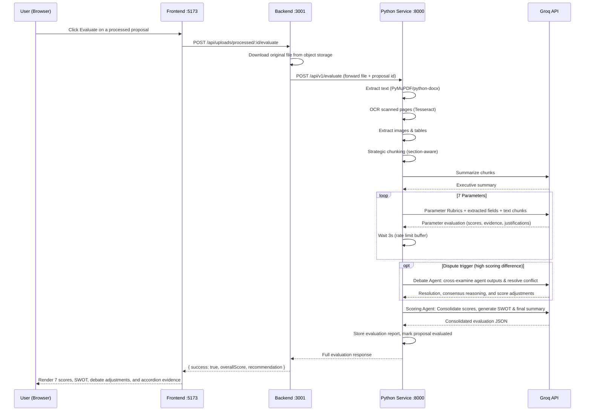

# Architecture — AI Proposal Evaluator

> Current state of the system as of May 2026.

---

## System Overview

The platform evaluates startup/agriculture proposals using AI. It has **three services**:

```
┌─────────────┐      ┌─────────────────┐      ┌─────────────────────────┐
│   Frontend   │─────▶│  Node.js Backend │─────▶│  Python AI Service      │
│  React/Vite  │ :5173│  Express/TS      │ :3001│  FastAPI                │ :8000
│              │◀─────│                  │◀─────│                         │
└─────────────┘      └─────────────────┘      └─────────────────────────┘
```

| Service | Stack | Port | Role |
|---------|-------|------|------|
| **Frontend** | React 19, Vite, TailwindCSS v4 | 5173 | Upload UI, dashboards, score visualizations |
| **Backend** | Node.js, Express, TypeScript | 3001 | Auth (JWT), file upload to object storage, API gateway, PostgreSQL/local JSON persistence |
| **Python Service** | FastAPI, Python 3.11 | 8000 | Document processing (OCR, extraction, chunking) + AIAIC 7-agent evaluation, debate, and scoring |

---

## How an Evaluation Works (End-to-End)

The flow has three user-facing steps — upload, process, evaluate:

```
User uploads files → later clicks "Evaluate" on a processed proposal
          │
          ▼
┌──────────────────────────────────────────────────────────────┐
│ 1. Upload: POST /api/uploads (multipart, field "files")      │
│    Multer validates type & size (PDF, DOCX, DOC, PPTX, PPT, │
│    TXT, PNG, JPG, TIFF, BMP — max 50MB), then the backend    │
│    stores each file in object storage (MinIO or local disk). │
└──────────────────────────────────────────────────────────────┘
          │
          ▼
┌──────────────────────────────────────────────────────────────┐
│ 2. Process: POST /api/uploads/process { files: [{key,name}] }│
│    Backend downloads each object and forwards it to the      │
│    Python service for extraction + agri categorization.      │
│    Requires Python to be up (503 otherwise — no Node         │
│    fallback pipeline).                                       │
└──────────────────────────────────────────────────────────────┘
          │
          ▼
┌──────────────────────────────────────────────────────────────┐
│ 3. Evaluate: POST /api/uploads/processed/:id/evaluate        │
│    Backend downloads the original upload from storage and    │
│    sends it to POST /api/v1/evaluate with the proposal id    │
│    attached. Idempotent per proposal unless ?force=true.     │
└──────────────────────────────────────────────────────────────┘
          │
          ▼
┌──────────────────────────────────────────────────────────────┐
│ 4. Python Service receives the file                          │
│                                                              │
│    PHASE A: Document Processing                              │
│    ┌────────────────────────────────────────────────────┐    │
│    │ 1. Detect format (PDF/DOCX/PPTX/TXT/Image)        │    │
│    │ 2. Extract text:                                    │    │
│    │    - PDF  → PyMuPDF (fitz)                         │    │
│    │    - DOCX → python-docx                            │    │
│    │    - PPTX → python-pptx                            │    │
│    │    - TXT  → direct read                            │    │
│    │ 3. Check if PDF is scanned → OCR with Tesseract    │    │
│    │ 4. Extract embedded images → OCR each one          │    │
│    │ 5. Detect & extract tables                         │    │
│    │ 6. Strategic chunking:                              │    │
│    │    - Split on section headings (not arbitrary size) │    │
│    │    - Tag each chunk: financial? technical?          │    │
│    │    - Attach page numbers, section titles            │    │
│    │ 7. Generate executive summary via Groq LLM         │    │
│    └────────────────────────────────────────────────────┘    │
│                                                              │
│    PHASE B: Multi-Agent AI Evaluation                        │
│    ┌────────────────────────────────────────────────────┐    │
│    │ 7 parameter agents + debate & scoring in sequence: │    │
│    │                                                      │    │
│    │ Agent 1: ProblemRelevanceAgent                       │    │
│    │   → Target farmers, agricultural challenges          │    │
│    │                                                      │    │
│    │ Agent 2: SolutionReadinessAgent                      │    │
│    │   → Core technology TRL 5-9 & innovativeness         │    │
│    │                                                      │    │
│    │ Agent 3: PilotDesignAgent                            │    │
│    │   → Implementation plans, milestones, timelines      │    │
│    │                                                      │    │
│    │ Agent 4: FarmerAdoptionAgent                         │    │
│    │   → Incentives, user experience, gender/youth parity │    │
│    │                                                      │    │
│    │ Agent 5: ScaleUpAgent                                │    │
│    │   → Commercial pathways & commercial sustainability  │    │
│    │                                                      │    │
│    │ Agent 6: TeamCapacityAgent                           │    │
│    │   → Technical, business, & extension experience      │    │
│    │                                                      │    │
│    │ Agent 7: ComplianceAgent                             │    │
│    │   → Certifications, standards, safety guidelines     │    │
│    │                                                      │    │
│    │ Agent 8: DebateAgent (Conditional Trigger)           │    │
│    │   → Triggers when parameter score differences exceed │    │
│    │     dispute threshold; conducts cross-examination    │    │
│    │                                                      │    │
│    │ Agent 9: ScoringAgent                                │    │
│    │   → Synthesizes all parameter rubrics, SWOT, and     │    │
│    │     applies debate adjustments for final consensus   │    │
│    │                                                      │    │
│    │ Each agent:                                          │    │
│    │   - Receives target chunks + prior evaluations       │    │
│    │   - Calls Groq API (LLaMA 3.3 70B)                  │    │
│    │   - Has retry logic with exponential backoff        │    │
│    │   - Returns structured JSON with scores & evidence   │    │
│    │   - Waits 3s before next agent (rate limit buffer)  │    │
│    └────────────────────────────────────────────────────┘    │
└──────────────────────────────────────────────────────────────┘
          │
          ▼
┌──────────────────────────────────────────────────────────────┐
│ 5. Response flows back                                       │
│                                                              │
│    Python stores the evaluation report and marks the         │
│    proposal `evaluated`; Node.js returns the score +         │
│    recommendation; the frontend then fetches the full        │
│    report and renders scores, SWOT, debate, charts           │
└──────────────────────────────────────────────────────────────┘
```

There is **no Node.js fallback pipeline** — all extraction and evaluation happens in the Python service. If it is down, processing/evaluation endpoints return 503.

---

## Known Considerations

### 1. Groq Rate Limiting

**File:** `python-service/app/agents/orchestrator.py`

The free Groq tier has strict rate limits. One evaluation (extraction + 7 parameter agents + debate + scoring + summary) makes ~10–12 LLM calls in sequence.
With only a 3-second gap between agents, the rate limiter may trigger `RateLimitError`.

Each agent has retry logic (3 attempts with exponential backoff) to handle transient rate limit errors.

### 2. Persistence

The backend uses PostgreSQL (Docker) through a Firestore-like document store (`pgStore.ts`), and falls back to a local JSON file store (`localStore.ts`) when Postgres is unreachable — zero-config dev works with no containers running.

---

## File Structure

```
ai-proposal-evaluator/
│
├── frontend/                          # React + Vite + TailwindCSS
│   ├── src/
│   │   ├── pages/
│   │   │   ├── UploadPage.tsx         # File upload + evaluate trigger
│   │   │   ├── DashboardPage.tsx      # Score overview
│   │   │   └── ProposalDetailPage.tsx # Full evaluation results
│   │   └── services/
│   │       └── proposal.service.ts    # API calls to backend
│   └── vite.config.ts                 # Proxy /api → localhost:3001
│
├── backend/                           # Node.js + Express + TypeScript
│   ├── src/
│   │   ├── config/
│   │   │   ├── env.ts                 # Zod-validated env vars
│   │   │   ├── database.ts            # Picks Postgres or local JSON store
│   │   │   ├── pgStore.ts             # Firestore-like Postgres document store
│   │   │   └── localStore.ts          # JSON-file fallback (zero-config dev)
│   │   ├── modules/
│   │   │   ├── upload/                # Primary flow: upload/process/evaluate
│   │   │   ├── reports/               # Report listing + comparison
│   │   │   ├── proposal/              # Legacy proposal records (CRUD)
│   │   │   ├── auth/                  # Register/login/profile
│   │   │   └── settings/              # Settings registry + API
│   │   ├── utils/
│   │   │   └── pythonProxy.ts         # HTTP bridge to Python service
│   │   └── middleware/
│   │       ├── auth.ts                # JWT authentication
│   │       └── upload.ts              # In-memory multer for /api/uploads
│   └── .env
│
├── python-service/                    # FastAPI + Python 3.11
│   ├── app/
│   │   ├── main.py                    # FastAPI entry point
│   │   ├── config.py                  # Pydantic settings
│   │   ├── api/
│   │   │   ├── routes.py              # REST endpoints
│   │   │   └── dependencies.py        # LLM connection check
│   │   ├── services/
│   │   │   ├── extraction/            # Text, image, table, form extractors
│   │   │   │   ├── __init__.py
│   │   │   │   ├── text_extractor.py
│   │   │   │   ├── image_extractor.py
│   │   │   │   ├── table_extractor.py
│   │   │   │   └── form_field_extractor.py # Structural Q&A block extractor
│   │   │   ├── ocr/                   # Tesseract + EasyOCR engine
│   │   │   ├── processing/            # Chunker, summarizer, doc processor
│   │   │   └── llm/                   # Groq client with retries
│   │   ├── agents/
│   │   │   ├── base_agent.py          # Base class (retry, JSON parsing)
│   │   │   ├── orchestrator.py        # AIAIC evaluation orchestration
│   │   │   ├── extraction/            # Extraction agent
│   │   │   ├── problem_relevance/     # Problem relevance agent
│   │   │   ├── solution_readiness/    # Solution readiness agent
│   │   │   ├── pilot_design/          # Pilot design agent
│   │   │   ├── farmer_adoption/       # Farmer adoption agent
│   │   │   ├── scaleup/               # Scale-up agent
│   │   │   ├── team_capacity/         # Team capacity agent
│   │   │   ├── compliance/            # Compliance agent
│   │   │   ├── debate/                # Debate agent
│   │   │   └── scoring/               # Final scoring agent
│   │   ├── models/
│   │   │   ├── enums.py
│   │   │   └── schemas.py             # Pydantic request/response models
│   │   └── utils/
│   │       ├── text_cleaning.py
│   │       └── logging.py
│   ├── tests/                         # Unit & integration tests (pytest)
│   ├── .env
│   ├── requirements.txt
│   └── Dockerfile
│
└── docker-compose.yml                 # All 3 services
```

---

## Scoring & Rubric Design (AIAIC framework)

Under the AIAIC framework, the overall score is calculated as the flat average of the 7 parameter scores (each out of 100):

1. **Problem Relevance** (14.28%): Relevance, farming challenge, target farmers
2. **Solution Readiness** (14.28%): Novelty, TRL level, technical readiness
3. **Pilot Design** (14.28%): Implementation milestones, timeline realism
4. **Farmer Adoption** (14.28%): Parity, youth engagement, direct farmer benefits
5. **Scale-up Potential** (14.28%): Sustainability, scaling model, revenue pathways
6. **Team Capacity** (14.28%): Experience, credentials, division of responsibilities
7. **Compliance** (14.28%): Certifications, standards, safety guidelines

Each parameter score is calculated as the average of its sub-question scores (1-10 scale) multiplied by 10. The **Debate Agent** can apply positive/negative adjustments based on cross-examination.

---

## Environment Variables

### Backend (`backend/.env`)
| Variable | Required | Default | Description |
|----------|----------|---------|-------------|
| `JWT_SECRET` | ✅ | — | JWT signing key |
| `PYTHON_SERVICE_URL` | ❌ | `http://localhost:8000` | Python service address |
| `STORAGE_PROVIDER` | ❌ | `local` | Object storage: `local` or `minio` |
| `DATABASE_URL` | ❌ | — | Postgres connection (local JSON store if unreachable) |
| `GROQ_API_KEY` | ❌ | — | Surfaced via the Settings UI for the Python service |

### Python Service (`python-service/.env`)
| Variable | Required | Default | Description |
|----------|----------|---------|-------------|
| `GROQ_API_KEY` | ✅ | — | Groq LLM API key |
| `LLM_MODEL` | ❌ | `llama-3.3-70b-versatile` | Model to use |
| `PORT` | ❌ | `8000` | Service port |
| `MAX_FILE_SIZE_MB` | ❌ | `50` | Max upload size |
| `CHUNK_SIZE_TOKENS` | ❌ | `2000` | Chunk size for splitting |

---

## Data Flow Diagram



---

## Future Improvements

| Priority | Improvement | Impact |
|----------|-------------|--------|
| 🟡 Medium | Increase agent delay or add queuing | Better rate limit handling on free Groq tier |
| 🟡 Medium | Add RAG with vector database | Improved context retrieval for large docs |
| 🟢 Low | Multi-language proposal support | Broader user base |
| 🟢 Low | BullMQ + Redis job queue | Async evaluation for large documents |
