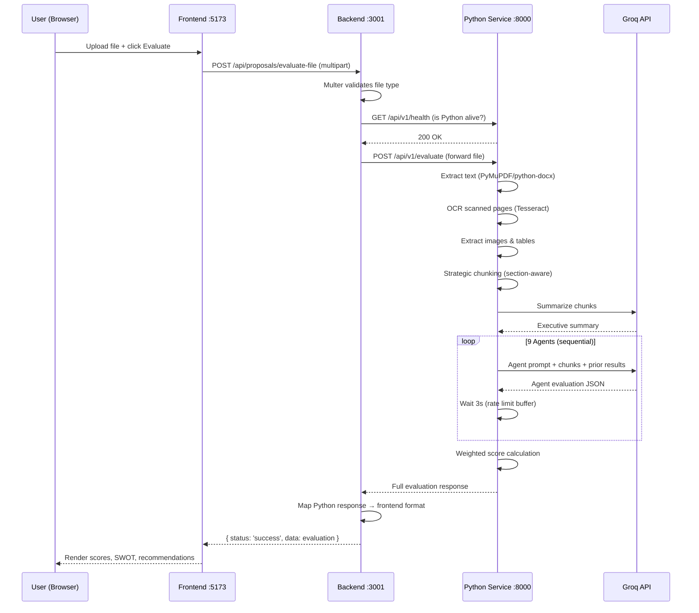

# Architecture — AI Proposal Evaluator

> Current state of the system as of May 2026.

---

## System Overview

The platform evaluates startup/agriculture proposals using AI. It has **three services**:

```
┌─────────────┐      ┌─────────────────┐      ┌─────────────────────────┐
│   Frontend   │─────▶│  Node.js Backend │─────▶│  Python AI Service      │
│  React/Vite  │ :5173│  Express/TS      │ :3001│  FastAPI                │ :8000
│              │◀─────│                  │◀─────│                         │
└─────────────┘      └─────────────────┘      └─────────────────────────┘
```

| Service | Stack | Port | Role |
|---------|-------|------|------|
| **Frontend** | React 19, Vite, TailwindCSS v4 | 5173 | Upload UI, dashboards, score visualizations |
| **Backend** | Node.js, Express, TypeScript | 3001 | Auth (JWT), file upload, API gateway, Firestore/local JSON persistence |
| **Python Service** | FastAPI, Python 3.11 | 8000 | Document processing (OCR, extraction, chunking) + 9-agent AI evaluation |

---

## How an Evaluation Works (End-to-End)

When a user uploads a proposal file on the frontend, this is the exact sequence:

```
User clicks "Evaluate" on frontend
          │
          ▼
┌──────────────────────────────────────────────────────────────┐
│ 1. Frontend sends POST /api/proposals/evaluate-file          │
│    with multipart form data (file + optional title)          │
│    The request goes to localhost:5173, which Vite proxies    │
│    to localhost:3001                                         │
└──────────────────────────────────────────────────────────────┘
          │
          ▼
┌──────────────────────────────────────────────────────────────┐
│ 2. Node.js Backend receives the request                      │
│                                                              │
│    a. Multer middleware validates file type & size            │
│       Currently allows: PDF, DOCX, DOC, TXT only             │
│       ⚠️  PPT, PPTX, images are BLOCKED here                │
│       Max size: 10MB                                         │
│                                                              │
│    b. ProposalController.evaluateFile() runs                 │
└──────────────────────────────────────────────────────────────┘
          │
          ▼
┌──────────────────────────────────────────────────────────────┐
│ 3. Backend checks: "Is Python service alive?"                │
│                                                              │
│    Calls GET http://localhost:8000/api/v1/health              │
│    with a 5-second timeout                                   │
│                                                              │
│    ┌─────────────────┐     ┌──────────────────────────────┐  │
│    │ Python is UP?   │─Yes─▶  Forward file to Python      │  │
│    │                 │     │  POST /api/v1/evaluate        │  │
│    │                 │─No──▶  Use Node.js fallback         │  │
│    │                 │     │  (old 4-agent pipeline)       │  │
│    └─────────────────┘     └──────────────────────────────┘  │
└──────────────────────────────────────────────────────────────┘
          │
          ▼ (if Python is available)
┌──────────────────────────────────────────────────────────────┐
│ 4. Python Service receives the file                          │
│                                                              │
│    PHASE A: Document Processing                              │
│    ┌────────────────────────────────────────────────────┐    │
│    │ 1. Detect format (PDF/DOCX/PPTX/TXT/Image)        │    │
│    │ 2. Extract text:                                    │    │
│    │    - PDF  → PyMuPDF (fitz)                         │    │
│    │    - DOCX → python-docx                            │    │
│    │    - PPTX → python-pptx                            │    │
│    │    - TXT  → direct read                            │    │
│    │ 3. Check if PDF is scanned → OCR with Tesseract    │    │
│    │ 4. Extract embedded images → OCR each one          │    │
│    │ 5. Detect & extract tables                         │    │
│    │ 6. Strategic chunking:                              │    │
│    │    - Split on section headings (not arbitrary size) │    │
│    │    - Tag each chunk: financial? technical?          │    │
│    │    - Attach page numbers, section titles            │    │
│    │ 7. Generate executive summary via Groq LLM         │    │
│    └────────────────────────────────────────────────────┘    │
│                                                              │
│    PHASE B: Multi-Agent AI Evaluation                        │
│    ┌────────────────────────────────────────────────────┐    │
│    │ 9 agents run SEQUENTIALLY (to avoid rate limits):   │    │
│    │                                                      │    │
│    │ Agent 1: ExtractionAgent                             │    │
│    │   → Pulls structured data: team, funding, timeline  │    │
│    │                                                      │    │
│    │ Agent 2: TechnicalAgent                              │    │
│    │   → Scores architecture, scalability, tech stack     │    │
│    │                                                      │    │
│    │ Agent 3: FinancialAgent                              │    │
│    │   → Analyzes revenue model, unit economics, ROI     │    │
│    │                                                      │    │
│    │ Agent 4: RiskAgent                                   │    │
│    │   → 9-dimensional risk assessment                   │    │
│    │                                                      │    │
│    │ Agent 5: InnovationAgent                             │    │
│    │   → Novelty, IP potential, disruption score         │    │
│    │                                                      │    │
│    │ Agent 6: FeasibilityAgent                            │    │
│    │   → Team capability, timeline realism, market fit   │    │
│    │                                                      │    │
│    │ Agent 7: ComplianceAgent                             │    │
│    │   → Governance, data privacy, regulatory readiness  │    │
│    │                                                      │    │
│    │ Agent 8: SustainabilityAgent                         │    │
│    │   → Environmental, social, economic sustainability  │    │
│    │                                                      │    │
│    │ Agent 9: FinalScoringAgent                           │    │
│    │   → Cross-agent synthesis, contradiction detection   │    │
│    │   → Weighted final score calculation                │    │
│    │                                                      │    │
│    │ Each agent:                                          │    │
│    │   - Receives all chunks + previous agent results    │    │
│    │   - Calls Groq API (LLaMA 3.3 70B)                 │    │
│    │   - Has retry logic with exponential backoff        │    │
│    │   - Returns structured JSON with score + analysis   │    │
│    │   - Waits 3s before next agent (rate limit buffer)  │    │
│    └────────────────────────────────────────────────────┘    │
└──────────────────────────────────────────────────────────────┘
          │
          ▼
┌──────────────────────────────────────────────────────────────┐
│ 5. Response flows back                                       │
│                                                              │
│    Python → Node.js: Full evaluation JSON                    │
│    Node.js maps Python response to frontend-expected format  │
│    Node.js → Frontend: { status: 'success', data: {...} }    │
│                                                              │
│    Frontend renders: scores, SWOT, recommendations, charts   │
└──────────────────────────────────────────────────────────────┘
```

---

## The Fallback Mechanism

If the Python service is **not running** or **fails mid-evaluation**, the backend falls back to its original Node.js pipeline:

```
Node.js Fallback (Legacy)
├── extractTextFromBuffer() — basic PDF/DOCX text extraction (no OCR, no chunking)
└── aiOrchestrator.evaluate() — 4 simpler agents (not 9)
    ├── Extraction Agent
    ├── Agriculture Analysis Agent
    ├── Financial Analysis Agent
    └── Final Scoring Agent
```

The Node.js pipeline is simpler:
- **No OCR** — can't read scanned PDFs or images
- **No smart chunking** — sends raw text to the LLM
- **4 agents** instead of 9 — less comprehensive analysis
- **No table/image extraction**

---

## Current Known Issues

### 1. Multer File Filter is Too Restrictive

**File:** `backend/src/modules/proposal/proposal.routes.ts` (lines 13-25)

The multer middleware only allows 4 MIME types:
```
application/pdf
application/vnd.openxmlformats-officedocument.wordprocessingml.document
application/msword
text/plain
```

This **blocks** PPT, PPTX, PNG, JPG, TIFF — formats the Python service fully supports.
It also blocks files where `curl` or the browser sends `application/octet-stream` as MIME type.

### 2. Groq Rate Limiting

**File:** `python-service/app/agents/orchestrator.py`

The free Groq tier has strict rate limits. Running 9 agents + summary = ~10-11 LLM calls in sequence.
With only a 3-second gap between agents, the rate limiter kicks in and agents fail with `RateLimitError`.

Each agent has retry logic (3 attempts with exponential backoff), but if the rate limit window hasn't reset, all retries also fail.

### 3. Firebase Service Account

The backend tries to connect to Firebase Firestore but falls back to a local JSON file store when credentials are missing. The local store now works correctly for all operations (CRUD, count, pagination).

---

## File Structure

```
ai-proposal-evaluator/
│
├── frontend/                          # React + Vite + TailwindCSS
│   ├── src/
│   │   ├── pages/
│   │   │   ├── UploadPage.tsx         # File upload + evaluate trigger
│   │   │   ├── DashboardPage.tsx      # Score overview
│   │   │   └── ProposalDetailPage.tsx # Full evaluation results
│   │   └── services/
│   │       └── proposal.service.ts    # API calls to backend
│   └── vite.config.ts                 # Proxy /api → localhost:3001
│
├── backend/                           # Node.js + Express + TypeScript
│   ├── src/
│   │   ├── config/
│   │   │   ├── env.ts                 # Zod-validated env vars
│   │   │   ├── database.ts           # Firebase or local JSON store
│   │   │   └── localStore.ts          # Firestore-compatible JSON fallback
│   │   ├── modules/
│   │   │   ├── proposal/
│   │   │   │   ├── proposal.routes.ts      # Multer + route definitions
│   │   │   │   ├── proposal.controller.ts  # Python-first, Node.js fallback
│   │   │   │   └── proposal.service.ts     # CRUD operations
│   │   │   └── ai/
│   │   │       ├── ai.service.ts           # Stored proposal evaluation
│   │   │       ├── orchestrator.ts         # Legacy 4-agent pipeline
│   │   │       └── agents/                 # Node.js agent implementations
│   │   ├── utils/
│   │   │   ├── pythonProxy.ts         # HTTP bridge to Python service
│   │   │   └── textExtractor.ts       # Basic text extraction (fallback)
│   │   └── middleware/
│   │       ├── auth.ts                # JWT authentication
│   │       └── upload.ts              # Disk-based multer for /upload
│   └── .env
│
├── python-service/                    # FastAPI + Python 3.11
│   ├── app/
│   │   ├── main.py                    # FastAPI entry point
│   │   ├── config.py                  # Pydantic settings
│   │   ├── api/
│   │   │   └── routes.py             # REST endpoints
│   │   ├── services/
│   │   │   ├── document_processor.py  # Full pipeline orchestrator
│   │   │   ├── text_extractor.py      # PDF/DOCX/PPTX/TXT extraction
│   │   │   ├── ocr_engine.py          # Tesseract + EasyOCR
│   │   │   ├── image_extractor.py     # Image extraction from docs
│   │   │   ├── table_extractor.py     # Table detection
│   │   │   ├── chunker.py            # Section-aware chunking
│   │   │   ├── summarizer.py         # LLM-powered summaries
│   │   │   └── llm_client.py         # Groq client with retries
│   │   ├── agents/
│   │   │   ├── base_agent.py          # Base class (retry, JSON parsing)
│   │   │   ├── extraction_agent.py
│   │   │   ├── technical_agent.py
│   │   │   ├── financial_agent.py
│   │   │   ├── risk_agent.py
│   │   │   ├── innovation_agent.py
│   │   │   ├── feasibility_agent.py
│   │   │   ├── compliance_agent.py
│   │   │   ├── sustainability_agent.py
│   │   │   ├── scoring_agent.py
│   │   │   └── orchestrator.py        # 9-agent sequential pipeline
│   │   ├── models/
│   │   │   ├── enums.py
│   │   │   └── schemas.py            # Pydantic request/response models
│   │   └── utils/
│   │       ├── text_cleaning.py
│   │       └── logging.py
│   ├── .env
│   ├── requirements.txt
│   └── Dockerfile
│
└── docker-compose.yml                 # All 3 services
```

---

## Scoring Weights (Python 9-Agent Pipeline)

```
Final Score = weighted average of all agent scores

Innovation    ███████████████  15%
Market        ███████████████  15%
Technical     ███████████████  15%
Financial     ███████████████  15%
Feasibility   ███████████████  15%
Risk          ██████████       10%
Sustainability█████            5%
Compliance    █████            5%
Agriculture   █████            5%
```

---

## Environment Variables

### Backend (`backend/.env`)
| Variable | Required | Default | Description |
|----------|----------|---------|-------------|
| `JWT_SECRET` | ✅ | — | JWT signing key |
| `GROQ_API_KEY` | ✅ | — | Groq LLM API key (for fallback) |
| `PYTHON_SERVICE_URL` | ❌ | `http://localhost:8000` | Python service address |
| `LLM_PROVIDER` | ❌ | `groq` | LLM provider for Node.js fallback |
| `FIREBASE_PROJECT_ID` | ❌ | — | Firebase project (uses local JSON if absent) |

### Python Service (`python-service/.env`)
| Variable | Required | Default | Description |
|----------|----------|---------|-------------|
| `GROQ_API_KEY` | ✅ | — | Groq LLM API key |
| `LLM_MODEL` | ❌ | `llama-3.3-70b-versatile` | Model to use |
| `PORT` | ❌ | `8000` | Service port |
| `MAX_FILE_SIZE_MB` | ❌ | `50` | Max upload size |
| `CHUNK_SIZE_TOKENS` | ❌ | `2000` | Chunk size for splitting |

---

## Data Flow Diagram



---

## What Needs Fixing Next

| Priority | Issue | Impact |
|----------|-------|--------|
| 🔴 High | Multer MIME filter blocks PPT/images | Users can't upload supported formats |
| 🔴 High | Groq rate limits cause agent failures | Evaluation scores come back as 0 |
| 🟡 Medium | Agent delay too short (3s) | Rate limits hit on free tier |
| 🟢 Low | Firebase credentials missing | Using local JSON (works fine for dev) |
