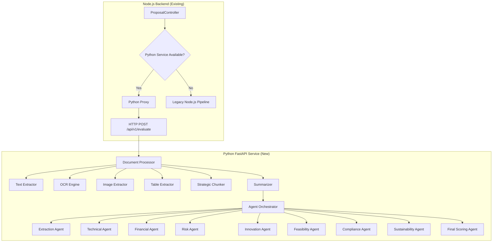

# Python AI Processing Service — Walkthrough

## What Was Built

A production-grade **Python FastAPI microservice** (`python-service/`) that handles advanced document processing and multi-agent AI evaluation for the proposal evaluation platform.

---

## Architecture



---

## File Structure

```
python-service/
├── app/
│   ├── __init__.py
│   ├── config.py              # Pydantic settings (env-based)
│   ├── main.py                # FastAPI entry point
│   ├── agents/
│   │   ├── base_agent.py      # Base class with LLM integration + retries
│   │   ├── extraction_agent.py    # Structured data extraction
│   │   ├── technical_agent.py     # Architecture, scalability, tech stack
│   │   ├── financial_agent.py     # Revenue, unit economics, ROI
│   │   ├── risk_agent.py          # 9-dimensional risk assessment
│   │   ├── innovation_agent.py    # Novelty, IP, disruption potential
│   │   ├── feasibility_agent.py   # Team, timeline, market validation
│   │   ├── compliance_agent.py    # Governance, data privacy, security
│   │   ├── sustainability_agent.py # Environmental, social, economic
│   │   ├── scoring_agent.py       # Cross-agent synthesis + final score
│   │   └── orchestrator.py        # Sequential pipeline coordinator
│   ├── api/
│   │   ├── dependencies.py
│   │   └── routes.py           # REST endpoints
│   ├── models/
│   │   ├── enums.py            # All enumerations
│   │   └── schemas.py          # Pydantic request/response models
│   ├── services/
│   │   ├── llm_client.py       # Groq client with retries + JSON parsing
│   │   ├── text_extractor.py   # PDF/DOCX/PPTX/TXT extraction
│   │   ├── ocr_engine.py       # Tesseract + EasyOCR fallback
│   │   ├── image_extractor.py  # Image extraction + OCR from all formats
│   │   ├── table_extractor.py  # Table detection + structured extraction
│   │   ├── chunker.py          # Section-aware strategic chunking
│   │   ├── summarizer.py       # LLM-based summarization
│   │   └── document_processor.py  # Full pipeline orchestrator
│   └── utils/
│       ├── text_cleaning.py    # Unicode, OCR artifacts, section detection
│       ├── logging.py          # Structured logging (structlog)
│       └── http_client.py      # Internal HTTP client
├── .env                        # Configuration (Groq key)
├── .env.example
├── Dockerfile
├── requirements.txt
└── pyproject.toml
```

---

## API Endpoints

| Endpoint | Method | Description |
|----------|--------|-------------|
| `/api/v1/health` | GET | Health check (LLM, OCR status) |
| `/api/v1/supported-formats` | GET | List supported file formats |
| `/api/v1/process-document` | POST | Extract text, images, tables, chunk |
| `/api/v1/evaluate` | POST | Full pipeline: process + 7-agent evaluation |
| `/api/v1/evaluate-chunks` | POST | Evaluate pre-processed chunks |
| `/docs` | GET | Interactive Swagger documentation |

---

## Key Design Decisions

### Document Processing
- **PyMuPDF** over pdf-parse — 10x faster, native table detection, image extraction
- **Tesseract OCR** as primary, EasyOCR as fallback — handles scanned PDFs
- **Section-aware chunking** — splits on detected headings, not arbitrary character limits
- **Metadata-rich chunks** — each chunk tagged with financial/technical flags, page numbers, section titles

### AI Evaluation
- **9 sequential agents** (not parallel) to respect Groq rate limits
- **Extraction → Analysis → Scoring** pipeline where extraction results feed into all subsequent agents
- **Cross-agent reasoning** in the final scoring agent detects contradictions between agents
- **Weighted scoring**: Innovation 15%, Market 15%, Technical 15%, Financial 15%, Feasibility 15%, Risk 10%, Sustainability 5%, Compliance 5%, Agriculture 5%

### Integration
- **Graceful fallback**: If Python service is down, Node.js uses its original pipeline
- **No breaking changes**: Frontend untouched, same response shape via mapping layer

---

## How to Run Locally

```bash
# 1. Navigate to python-service
cd python-service

# 2. Create virtual environment
python3 -m venv venv
source venv/bin/activate

# 3. Install dependencies
pip install -r requirements.txt

# 4. Copy env file and set your Groq key
cp .env.example .env
# Edit .env and set GROQ_API_KEY

# 5. Start the service
uvicorn app.main:app --host 0.0.0.0 --port 8000 --reload
```

### System Dependencies (for OCR)
```bash
# Ubuntu/Debian
sudo apt install tesseract-ocr tesseract-ocr-eng poppler-utils libmagic1
```

---

## Verification Results

| Check | Status |
|-------|--------|
| App imports successfully | ✅ |
| Health endpoint (LLM connected) | ✅ |
| Health endpoint (Tesseract available) | ✅ |
| Supported formats endpoint | ✅ |
| Document processing (DOCX) | ✅ |
| Section detection (13 sections found) | ✅ |
| Chunk metadata tagging | ✅ |
| Server hot-reload in development | ✅ |

---

## Node.js Backend Changes

| File | Change |
|------|--------|
| [env.ts](file:///home/siddhant/workspaces/ai-proposal-evaluator/backend/src/config/env.ts) | Added `PYTHON_SERVICE_URL` config |
| [pythonProxy.ts](file:///home/siddhant/workspaces/ai-proposal-evaluator/backend/src/utils/pythonProxy.ts) | **[NEW]** HTTP proxy to Python service |
| [proposal.controller.ts](file:///home/siddhant/workspaces/ai-proposal-evaluator/backend/src/modules/proposal/proposal.controller.ts) | Routes evaluation through Python first |
| [ai.service.ts](file:///home/siddhant/workspaces/ai-proposal-evaluator/backend/src/modules/ai/ai.service.ts) | Routes stored proposal evaluation through Python |
| [docker-compose.yml](file:///home/siddhant/workspaces/ai-proposal-evaluator/docker-compose.yml) | Added python-service container |
| [.env](file:///home/siddhant/workspaces/ai-proposal-evaluator/backend/.env) | Added `PYTHON_SERVICE_URL` |
